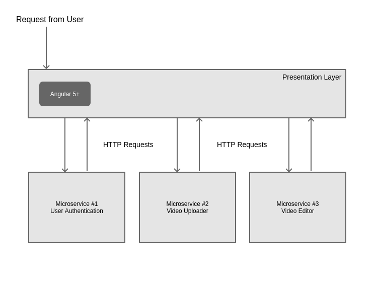

# Run the app

You will need MongoDB installed on your computer, start the service, create a database, and create a user to interact with that database.  Don't worry if you do not understand all the commands; this tutorial is not a MongoDB tutorial!

```bash 
mongo

use test_db_2

db.createUser(
    {
        user: "yourname",
        pwd: "yourpassword",
        roles: [ "readWrite", "dbAdmin" ]
    }
)
```

```
# Set your environment variables
# Same as above!
export DB_USER=yourname
export DB_PW=yourpassword
```

Now, we need to start all of the pieces to our application.  You could easily create a script that starts all the pieces at once, but it is more educational to do it manually.

As you will read in the explanation section, this application has three parts: 

1. Microservice #1 (localhost:8081)
2. Microservice #2 (localhost:8082)
3. User Interface Static Server (localhost:8080)

Open up 3 terminal windows and go to the root of this project in all of them.  Now enter the following commands.

```bash 
# Terminal window #1

node app.js
```

```bash
# Terminal window #2

# Set your environment variables to connect to Database
export DB_USER=yourname
export DB_PW=yourpassword

node game/server.js
```

```bash
# Terminal window #3

# Set your environment variables to connect to Database
export DB_USER=yourname
export DB_PW=yourpassword

node user-authentication/server.js
```

Now, open your brower to `http://localhost:8080` and your app is running!

# Explanation 

In this repository is a microservices software architecture as explained in my blog post: [How to Build a Production Web Application Part 4: Architecture](https://zachgoll.github.io/blog/2019/build-production-web-app-part-4/)



The key element of a microservices architecture is the fact that each microservice is entirely separated from the other microservices.  Usually, the front-end user interface utilizes multiple microservices so that the user does not need to visit several applications to do one simple task.  The true value of this architecture comes when you have a complex application and several teams working on that application.  With the monolithic and layered architectures, all the teams must coordinate their efforts to support and improve the application.  With a microservices architecture, you could have three teams who have never talked to each other face-to-face working on the same application.

This is made possible because the microservices and the user interface all communicate through APIs.  In my example below, they are all communicating through the HTTP protocol (the internet).

Below, I have created a simplistic version of a microservices architecture.  Unfortunately, there is not a great way to demonstrate a microservices architecture because by nature, a microservices architecture is designed for _complex applications_.  You will see the general concept, but until you have gotten your hands dirty, there is no way to appreciate the true value of such an architecture.

## Example

In this overly simplistic representation of a microservices architecture, I have split an "application" (in quotes because it is really a combination of microservices) into three parts: 

1. **Microservice #1** - User authentication
    * Register - User can register with an email and password 
    * Sign In - User can sign in with email and password
    * Log out - User can log out
2. **Microservice #2** - Game
    * Play game - Once authenticated, user can play a simple game
    * See game results history - Every time the user plays the game, a new record is entered into the database with their score
3. **Front-End User Interface**
    * Controls the interactive Javascript functionality of the application
    * Brings together the two microservices into a **single user experience**.

You will notice that the design of each microservice resembles the [layered architecture](https://github.com/zachgoll/layered-architecture-example-app) that I previously covered.  This is where software architecture and design patterns become confusing to the novice.  Sometimes you will find one architecture built behind the door of another architecture.

### Microservice #1 - User Authentication (http://localhost:8081)

_Note: The password authentication is not implemented as you should in a production application; it is solely for demonstration and you should never store your users' passwords in plain text like I am doing here!_

**This microservice is solely responsible for creating and authenticating users.**    

In many complex applications, an entire server will be devoted to authenticating and managing users.  After all, without users, you have no application.  Therefore, it is critical to not only implement the user functionality, but maintain proper security and protect the users' data.

To understand why a user authentication microservice might be useful, imagine a large company that offers a wide variety of services to their users.  A perfect example is Google because you not only use your login credentials for Gmail and other core Google services; you also use it to log into YouTube and many other applications.  

Imagine if Google implemented a user authentication scheme in **each individual application**!!  This is highly inefficient, so instead, Google created a "microservice" that functions as user authentication for not only Google applications, but an increasingly large number of 3rd party applications.  This is made possible because the authentication microservice is _decoupled_ from the underlying infrastructure with robust APIs.  **This is the goal of microservices.**

You will see in the application that I have created a much much much much much (did I say much?) simpler authentication microservice than what Google owns.  Nevertheless, it demonstrates how we might implement an "authentication API" for one or more applications.

Below, you'll see the three API endpoints that this microservice exposes: 

```javascript
app.post('/register', function(req, res, next) {
    
    const newUser = new User({
        email: req.body.email,
        password: req.body.password
    });
    
    User.createUser(newUser, (err, user) => {
        res.status(200).json(user);
    });
});

app.post('/authenticate', (req, res, next) => {
    const email = req.body.email;
    const password = req.body.password;

    User.getUserByEmail(email, (error, user) => {
        if (user && user.password == password) {
            // User entered the correct password and we should authenticate them!
            res.status(200).json({ authenticated: true });
        } else {
            // User entered the wrong password
            res.status(200).json({ authenticated: false });
        }
    });

});

app.get('/get-user/:useremail', function(req, res) {
    User.getUserByEmail(req.params.useremail, (error, user) => {
        res.status(200).json({ email: user.email, password: user.password });
    });    
});
```

Our front-end user application can use these three endpoints at `localhost:8081` to manage users!

### Microservice #2 - Game (http://localhost:8082)

**This microservice is solely responsible for managing gameplay results of all the application users registered through the authentication microservice.**

The game microservice is a bit simpler than the user authentication microservice, but demonstrates how we can separate core pieces of functionality of our applications.  Although this is a simple game, you could imagine a much more complex scenario where the game had all sorts of graphic elements and user data.

Below are the two API endpoints that the Game microservice exposes: 

```javascript
// Register API Call
app.post('/score', function(req, res, next) {

    const score = req.body.result;
    const winValue = score == "win" ? 1 : 0;
    const lossValue = score == "loss" ? 1 : 0;
    const email = req.body.email;

    // See if user has posted a score already
    Game.getUserScoresByEmail(email, (err, user) => {
        // If user hasn't posted a score yet, create an entry for their count in the database
        if (!user) {
            Game.createUserWithScore(new Game({
                email: email,
                wins: winValue,
                losses: lossValue
            }), (err, user) => {
                res.status(200).json(user);
            });
        } else {
            // If user already has posted a score, update his/her win and loss count based on result
            Game.updateUserScores(email, winValue, lossValue, (err, count) => {
                res.status(200).json(count);
            });
        }
    });
});

app.get('/score/:email', function (req, res, next) {
    
    Game.getUserScoresByEmail(req.params.email, (err, user) => {
        res.status(200).json(user);
    });
});
```

## Conclusion

By decoupling an application into components, it becomes easier to test, improve, and manage each part.  Through this simplified example, you can see how microservices enable _independent development_ across multiple, functional teams.